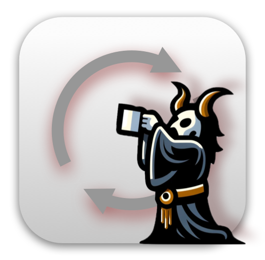

#  Azure Refresh Button Worshiper, Browser Extension

[{: width="33%" }](https://aleksandr.vin/a-link-to-app-store)

It waits 10s after you stop moving mouse or typing keyboard, then clicks on **Refresh** button on the page.
Only on `https://*.azure.com/*`.

[Install extension from App Store (TBD)](https://aleksandr.vin/a-link-to-app-store)

Check on video:

[{: width="100%" }](https://vimeo.com/888433348/f74eb27541?share=copy)
